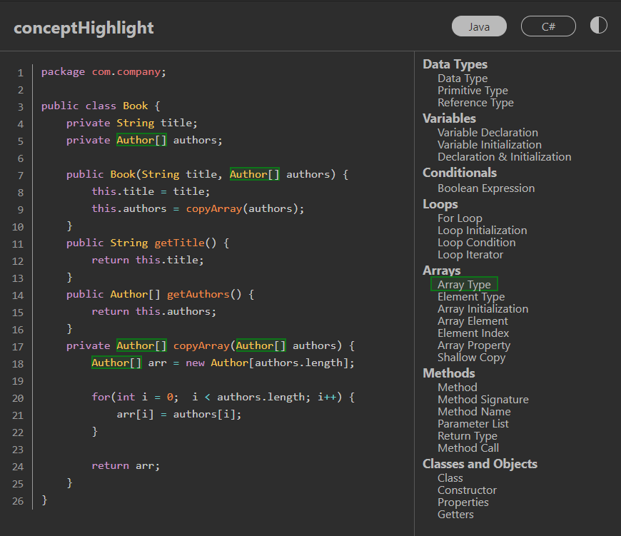

# conceptHighlight

MVP for displaying programming concepts in example code to learners.

### Features

- Select a programming concept from a list to highlight the relevant section in the example code.
- Switch between Java and C# example code.
- Toggle dark/light modes to match code highlighting theme.

### TODO

#### Select from code

- Add ability to select example code to highlight the relevant concept.

#### Find a less tedious way to markup example code

- Short of writing a parser I'm not sure what to do about this. Maybe the fact that we're interested in only a small number tokens would simplify this.
- Using your editor's _surround_ command helps with this, but the resulting code block is hard to read.
- The spacing for the rendered code is very sensitive to changes in the `<pre><code>` block.
- Some this might be alleviated by relying more on the classes added by Prism.js, especially with the [highlight-keywords](https://prismjs.com/plugins/highlight-keywords/) plugin.
